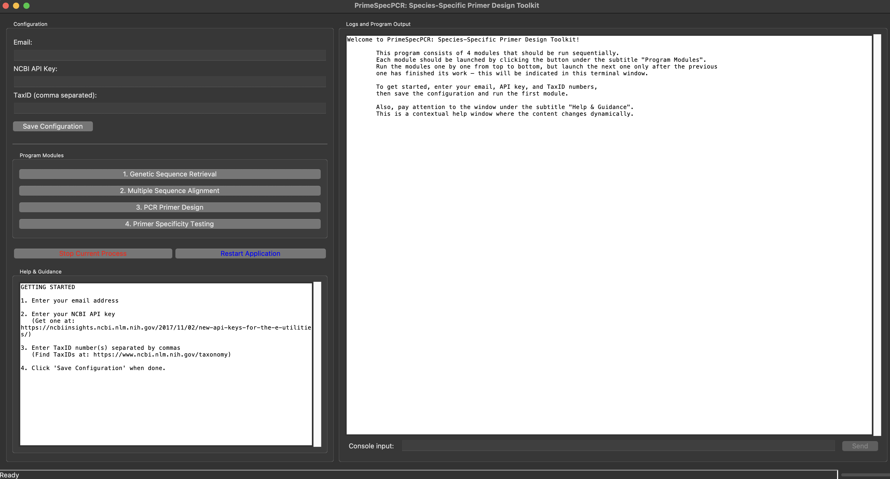

# PrimeSpecPCR: Species-Specific Primer Design Toolkit

## Table of Contents

- [Introduction](#introduction)
- [Features](#features)
- [System Requirements](#system-requirements)
- [Installation](#installation)
  - [Linux Installation](#linux-installation)
  - [macOS Installation](#macos-installation)
  - [Installing from Source](#installing-from-source)
- [Workflow Overview](#workflow-overview)
- [Modules](#modules)
  - [Module 1: Genetic Sequence Retrieval](#module-1-genetic-sequence-retrieval)
  - [Module 2: Multiple Sequence Alignment](#module-2-multiple-sequence-alignment)
  - [Module 3: PCR Primer Design](#module-3-pcr-primer-design)
  - [Module 4: Primer Specificity Testing](#module-4-primer-specificity-testing)
- [Using the GUI Interface](#using-the-gui-interface)
  - [Configuration Panel](#configuration-panel)
  - [Module Controls](#module-controls)
  - [Help and Guidance Panel](#help-and-guidance-panel)
  - [Log and Output Panel](#log-and-output-panel)
  - [Input Controls](#input-controls)
- [Working with Examples](#working-with-examples)
- [Command Line Usage](#command-line-usage)
- [Parameter Files](#parameter-files)
  - [PCR_primer_settings.txt](#pcr_primer_settingstxt)
  - [primer_specificity_settings.txt](#primer_specificity_settingstxt)
- [Troubleshooting](#troubleshooting)
- [Citations](#citations)
- [License](#license)
- [Acknowledgements](#acknowledgements)

## Introduction

PrimeSpecPCR is a tool for designing species-specific oligonucleotides for quantitative PCR (qPCR) applications in microbiology, environmental science, food safety, and clinical diagnostics. It automates the entire workflow from retrieving genetic sequences from public databases to generating highly specific primer-probe sets optimized for target organisms.

The toolkit addresses a critical challenge in molecular diagnostics: developing oligonucleotides that can reliably discriminate between closely related species. PrimeSpecPCR achieves this through a rigorous, multi-stage approach that systematically identifies conserved regions within a target species while simultaneously evaluating cross-reactivity with non-target organisms.

## Features

- **Automated Sequence Retrieval**: Direct access to NCBI GenBank sequences using taxonomy IDs
- **Gene Feature Detection**: Automatic identification and categorization of genes from retrieved sequences
- **Advanced Multiple Sequence Alignment**: Integration with MAFFT for high-quality alignments with customizable parameters
- **Consensus Sequence Generation**: Creation of consensus sequences with adjustable thresholds
- **Optimized Primer and Probe Design**: Implementation using the Primer3-py library for thermodynamic assessment, structural evaluation, and generation of qPCR-optimized primer-probe sets
- **Specificity Testing**: In silico validation against GenBank to identify potential cross-reactivity
- **Species-Specificity Verification**: Taxonomic assessment of primer matches to ensure target specificity
- **Interactive Results Visualization**: HTML dashboards for exploring primer specificity profiles
- **User-Friendly GUI Interface**: Step-by-step workflow guidance with contextual help
- **Flexible Configuration**: Customizable parameters for all analysis stages
- **Logging**: Detailed tracking of each analysis step for reproducibility

## System Requirements

- **Operating Systems**: 
  - Linux (Ubuntu 20.04+, Debian 10+, Fedora 32+)
  - macOS (10.15 Catalina or newer)
  - Windows support is experimental and not fully tested
  
- **Software Dependencies**:
  - Python 3.8 or higher
  - MAFFT (v7.450 or higher) for sequence alignment
  - Internet connection for accessing NCBI databases
  
- **Python Package Dependencies**:
  - biopython (≥1.79)
  - primer3-py (≥0.6.1)
  - pandas (≥1.3.0)
  - numpy (≥1.20.0)
  - tqdm (≥4.61.0)
  - validators (≥0.18.2)
  - requests (≥2.25.0)
  - tkinter (for GUI)

- **NCBI Credentials**:
  - Valid email address
  - NCBI API key (obtain at: https://ncbiinsights.ncbi.nlm.nih.gov/2017/11/02/new-api-keys-for-the-e-utilities/)

## Installation

### Linux Installation

1. Install system dependencies:
   ```bash
   sudo apt update
   sudo apt install python3 python3-pip python3-tk mafft
   ```

2. Clone the repository:
   ```bash
   git clone https://github.com/Adv20202/PrimeSpecPCR.git
   cd PrimeSpecPCR
   ```

3. Install Python dependencies:
   ```bash
   pip3 install -r requirements.txt
   ```

4. Run the application:
   ```bash
   python3 PrimeSpecPCR.py
   ```

> **Note**: For Fedora/RHEL-based systems, use `dnf` instead of `apt` and `python3-tkinter` instead of `python3-tk`.

### macOS Installation

1. Install Homebrew (if not already installed):
   ```bash
   /bin/bash -c "$(curl -fsSL https://raw.githubusercontent.com/Homebrew/install/HEAD/install.sh)"
   ```

2. Install system dependencies:
   ```bash
   brew install python3 mafft
   ```

3. Clone the repository:
   ```bash
   git clone https://github.com/Adv20202/PrimeSpecPCR.git
   cd PrimeSpecPCR
   ```

4. Install Python dependencies:
   ```bash
   pip3 install -r requirements.txt
   ```

5. Run the application:
   ```bash
   python3 PrimeSpecPCR.py
   ```

### Installing from Source

For users who prefer to build from source or need to customize the installation:

1. Clone the repository:
   ```bash
   git clone https://github.com/Adv20202/PrimeSpecPCR.git
   cd PrimeSpecPCR
   ```

2. Create a virtual environment (recommended):
   ```bash
   python3 -m venv venv
   source venv/bin/activate  # On Windows: venv\Scripts\activate
   ```

3. Install dependencies:
   ```bash
   pip install -r requirements.txt
   ```

4. Install MAFFT if not already installed:
   - Linux: `sudo apt install mafft`
   - macOS: `brew install mafft`

5. Run the installation script to check all dependencies:
   ```bash
   python install_dependencies.py
   ```

6. Launch the application:
   ```bash
   python PrimeSpecPCR.py
   ```

## Workflow Overview

PrimeSpecPCR employs a systematic, sequential workflow divided into four main modules:

1. **Genetic Sequence Retrieval**: Downloads and organizes genetic sequences from NCBI based on taxonomy ID
2. **Multiple Sequence Alignment**: Aligns sequences and generates consensus for conserved regions identification
3. **PCR Primer Design**: Designs primer-probe sets optimized for qPCR applications
4. **Primer Specificity Testing**: Evaluates primer specificity against GenBank sequences

Each module builds upon the outputs of the previous one, creating an analysis pipeline for species-specific primer design.

## Modules

### Module 1: Genetic Sequence Retrieval

**Purpose**: Automatically retrieve genetic sequences from NCBI GenBank for specified taxonomic IDs (TaxIDs).

**Input**:
- TaxID number(s) for target organism(s)
- NCBI email address and API key

**Process**:
1. Validates the provided TaxID(s) against NCBI Taxonomy database
2. Searches for all available nucleotide sequences for the specified organism
3. Analyzes sequences to identify and categorize gene features
4. Groups sequences by gene annotations with consistent identifiers
5. Presents a ranked list of genes based on sequence availability
6. Allows selection of genes for further analysis
7. For each selected gene, displays candidate reference sequences
8. Uses selected reference sequences for BLAST searches to identify homologous regions
9. Downloads and organizes sequences for selected genes

**Output**:
- FASTA files containing sequences for each selected gene
- Statistics file summarizing gene distribution
- Log file detailing the retrieval process

**Directory**: `1_/`

**Key Features**:
- Batch processing for efficient handling of large datasets
- Automatic gene feature detection
- Guided reference sequence selection
- BLAST-based homology search to ensure sequence relevance

### Module 2: Multiple Sequence Alignment

**Purpose**: Align genetic sequences to identify conserved and variable regions across the target organism's genome.

**Input**:
- FASTA files from Module 1
- User selection of files to align
- Reference sequence selection for each alignment group

**Process**:
1. Displays available FASTA files from Module 1
2. Allows grouping of files for alignment
3. Sorts sequences by length for easier reference selection
4. Performs high-quality alignment using MAFFT
5. Filters sequences based on length threshold (excludes sequences >3000 nt)
6. Generates consensus sequences from alignments
7. Applies user-defined threshold for consensus generation

**Output**:
- MAFFT alignment files
- BLAST-like alignment visualizations
- Consensus sequences in FASTA format
- Alignment quality statistics

**Directory**: `2_/`

**Key Features**:
- Integration with MAFFT for accurate alignments
- Interactive file and reference sequence selection
- Consensus generation with adjustable thresholds
- Alignment quality assessment

### Module 3: PCR Primer Design

**Purpose**: Design PCR primer-probe sets optimized for qPCR based on the consensus sequences.

**Input**:
- Consensus sequences from Module 2
- User-specified primer design parameters (amplicon size range, etc.)

**Process**:
1. Loads consensus sequences from Module 2
2. Configures Primer3 with optimized parameters for qPCR applications
3. Implements iterative design to generate diverse primer sets
4. Evaluates thermodynamic properties (Tm, GC content, self-complementarity)
5. Ranks primer sets by quality scores
6. Provides multiple alternative primer sets for each target

**Output**:
- CSV files containing primer set information
- Detailed thermodynamic and structural analyses
- Primer set rankings based on design quality

**Directory**: `3_/`

**Key Features**:
- Optimized for real-time PCR applications
- Comprehensive thermodynamic analysis
- Progressive region exclusion for diverse primer options
- Customizable design parameters via `PCR_primer_settings.txt`

### Module 4: Primer Specificity Testing

**Purpose**: Test the designed primers against GenBank sequences to ensure target specificity and identify potential cross-reactivity.

**Input**:
- Primer sets from Module 3
- Optional target taxonomy IDs for specificity evaluation

**Process**:
1. Performs BLAST searches for each primer against GenBank
2. Retrieves matching sequences and aligns primers to matches
3. Evaluates specificity based on mismatch patterns and positions
4. Places special emphasis on 3' region specificity
5. Categorizes matches based on binding potential
6. Associates sequences with taxonomy information
7. Generates interactive HTML report for result visualization

**Output**:
- HTML dashboard with primer specificity profiles
- Specificity rankings for primer sets
- Visual alignment representations
- Taxonomic analysis of potential matches

**Directory**: `4_/`

**Key Features**:
- Region-specific mismatch analysis
- Structured scoring system for binding potential
- Taxonomy-based specificity assessment
- Interactive visualization of results
- Customizable specificity parameters via `primer_specificity_settings.txt`

## Using the GUI Interface



*Figure 1: PrimeSpecPCR's main interface showing the configuration panel (left), program output (right), and input controls (bottom).*

The PrimeSpecPCR graphical user interface provides a user-friendly environment for executing the entire workflow. The interface is divided into several key sections:

### Configuration Panel

Located on the left side of the interface, this panel contains:

- **User Parameters**:
  - Email input field: For your NCBI registered email
  - API Key input field: For your NCBI API key
  - TaxID input field: For entering taxonomy IDs (comma-separated)
  - "Save Configuration" button: Saves your settings for future use

- **Module Control Buttons**:
  - Sequential buttons for running each of the four modules

- **Process Control**:
  - "Stop Current Process" button: Halts the currently running module
  - "Restart Application" button: Refreshes the application

### Module Controls

The module buttons are organized sequentially, reflecting the workflow order:

1. **Genetic Sequence Retrieval**: Initiates the sequence download process
2. **Multiple Sequence Alignment**: Starts the alignment process
3. **PCR Primer Design**: Launches the primer design module
4. **Primer Specificity Testing**: Begins the specificity analysis

These buttons should be used in order, as each module depends on the output of the previous one.

### Help and Guidance Panel

This panel provides context-sensitive help based on the current operation:

- **Initial Setup**: Shows information about required credentials
- **Module-Specific Help**: Displays relevant guidance when a module is selected
- **Input Guidance**: Provides detailed explanations when user input is required

The help content updates dynamically based on the current program state and user actions.

### Log and Output Panel

Located on the right side of the interface, this panel shows:

- **Process Logs**: Real-time updates from the running module
- **Error Messages**: Notifications about any issues encountered
- **Progress Indicators**: Information about current processing status

This panel provides transparency into the program's operation and helps with troubleshooting.

### Input Controls

At the bottom of the interface:

- **Input Field**: For responding to program prompts
- **Send Button**: Submits your input to the running module
- **Input Message**: Yellow-highlighted area that displays the current prompt

These controls are enabled when the program requires user input and disabled otherwise.

## Working with Examples

PrimeSpecPCR includes several example datasets located in the `examples/` directory. Each example demonstrates the application of the toolkit to different target organisms:

- **Aspergillus tubingensis**: Fungal pathogen
- **Aviadenovirus**: Viral animal pathogen
- **Blumeria graminis**: Plant pathogenic fungus
- **Burkholderia glumae**: Bacterial plant pathogen
- **Daubentonia madagascariensis**: Mammalian species
- **Erwinia psidii**: Bacterial plant pathogen
- **Prevotella dentalis**: Bacterial human pathogen
- **Puccinia recondita**: Wheat leaf rust fungus
- **Treponema denticola**: Bacterial human pathogen
- **Welwitschia mirabilis**: Gymnosperm plant species

Each example folder contains its own README file with specific information about:
- The target organism and its relevance
- Special considerations for primer design
- Recommended parameters
- Expected results
- Validation information (where available)

To use an example, navigate to its directory and follow the instructions in its README file.

## Command Line Usage

While the GUI is recommended for most users, PrimeSpecPCR can also be run from the command line for advanced users or automated workflows:

```bash
# Running individual modules
python 1_Genetic_Background.py
python 2_MSA_Alignment.py
python 3_PCR_Primers_Design.py
python 4_Primers_Specificity.py

# Running with interactive mode for direct command line interaction
python 1_Genetic_Background.py --interactive
```

Command-line usage requires the same dependencies as the GUI version but allows for better integration with bioinformatics pipelines.

## Parameter Files

### PCR_primer_settings.txt

This file controls the primer design parameters in Module 3. Key settings include:

- **Primer Size Parameters**: Length constraints for primers and probes
- **Tm Parameters**: Melting temperature ranges and differentials
- **GC Content Parameters**: Acceptable GC percentage ranges
- **Structural Parameters**: Settings to prevent hairpins and dimers
- **Salt and DNA Concentration**: Physical conditions for Tm calculations

Edit this file to customize primer design for specific applications or conditions.

### primer_specificity_settings.txt

This file configures the specificity testing parameters in Module 4:

- **Search Parameters**: BLAST settings for database searches
- **Specificity Stringency**: Mismatch tolerances and critical regions
- **Cache Settings**: Directory configurations for sequence storage

Modify these settings to adjust the stringency of specificity testing based on your research needs.

## Troubleshooting

**MAFFT Installation Issues**:
- Ensure MAFFT is properly installed: `mafft --version`
- On Linux, install directly with: `sudo apt install mafft`
- On macOS, install with: `brew install mafft`
- If still not working, check the system PATH or use the built-in MAFFT installation option

**NCBI API Access**:
- Verify your API key is valid and correctly entered
- Check your internet connection
- Ensure you're not exceeding NCBI's usage limits
- Use the built-in rate limiting settings to prevent API blocks

**Alignment Failures**:
- Check for unusual characters in sequence files
- Try reducing the number of sequences being aligned
- Adjust memory allocation if working with very large sequences
- Use the length filtering option to exclude excessively long sequences

**Primer Design Issues**:
- Inspect consensus sequences for high ambiguity (N) content
- Adjust the primer design parameters for more permissive conditions
- Verify the amplicon size range is appropriate for your target regions
- Check that the consensus threshold wasn't set too high

**GUI Interface Problems**:
- Verify tkinter is installed: `python3 -c "import tkinter; print(tkinter.TkVersion)"`
- Check for console output indicating missing packages
- Run the install_dependencies.py script to resolve dependency issues

## Citations

When using PrimeSpecPCR in your research, please cite:

[Citation information will be added upon publication]

PrimeSpecPCR also incorporates several external tools and libraries that should be acknowledged:

- **MAFFT**: Katoh K, Standley DM. MAFFT multiple sequence alignment software version 7: improvements in performance and usability. Mol Biol Evol. 2013;30(4):772-780.
- **Biopython**: Cock PJ, Antao T, Chang JT, et al. Biopython: freely available Python tools for computational molecular biology and bioinformatics. Bioinformatics. 2009;25(11):1422-1423.

## License

PrimeSpecPCR is released under the MIT License. See the `LICENSE` file for details.

## Acknowledgements

We gratefully acknowledge the support of:
- NCBI for providing access to their genetic databases
- The developers of MAFFT, Primer3-py library, and other open-source tools incorporated in this project
- The research community for valuable feedback and testing

---

*For questions, suggestions, or contributions, please contact the developer at akuzdralinski@pjwstk.edu.pl*
